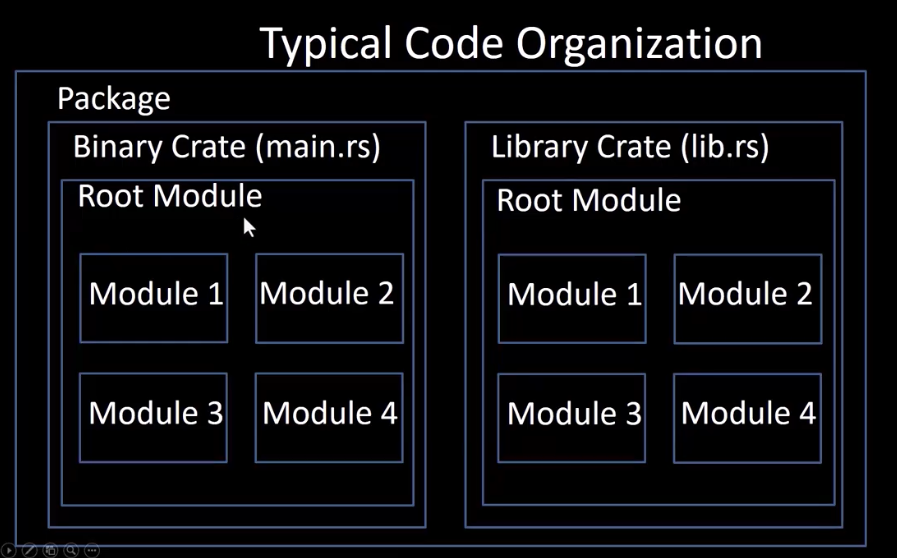

# Rust Modules 
## Packages 
- Managed through Cargo commands, like `cargo build`, `cargo run` and `cargo test `
- Highest level of code organizaiton 
- Contains one or more crates(crates are moer lower level compares with the package)
- Each package contains a file `Cargo.toml` this file serves as a central configuraiton file, managing a package's metadata, dependencies, how to build the crates and dependency that owns the optional features 

## Crates 
- A compilation unit, a crate contains a set of modules those modules are associated items, such as functions and structs 
- Can be a binary crate or a library crate, library crate aim is for sharing across modules, not for execution, but binary crate is for executable 
- Contains Modules(one crates contains one or more modules)

## Modules 
- Controls at a finer level, the structure, visibility and privacy 

## Rules for package 
- One package must have at least one crate 
- It can contain any number of binary crates
- But it can only contain at most 1 library crate  

## Rust Code Organizaiton 
